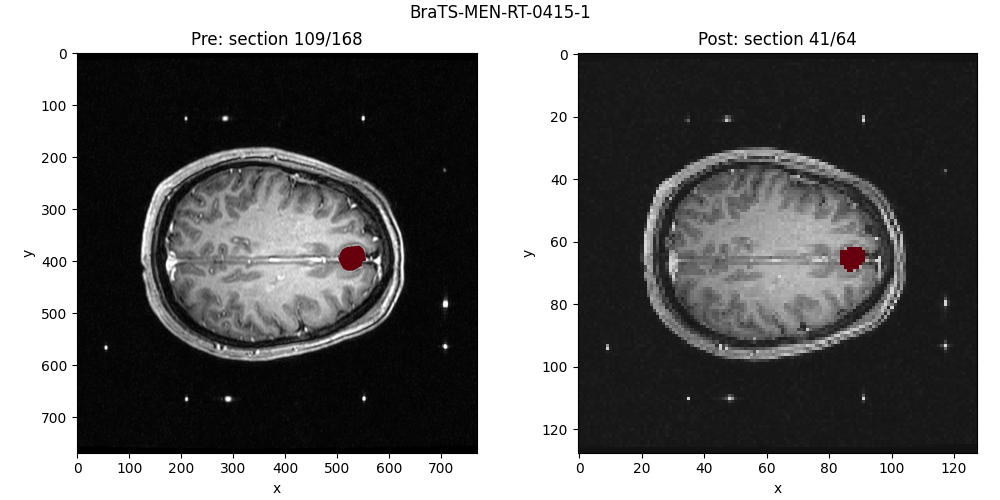
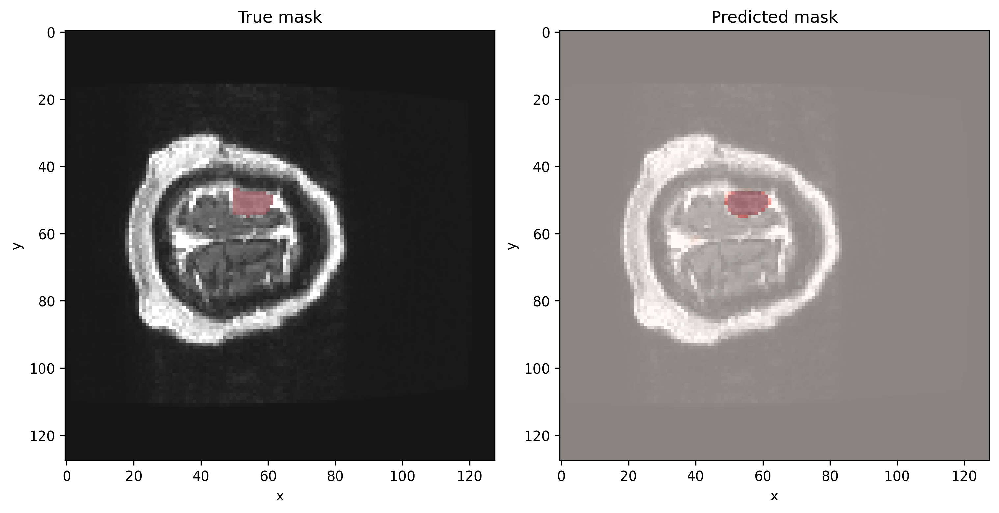

# Segmenting meningiomas in T1-weighted MRT images
In this repository, I use computer vision models to predict meningioma cancer segmentation masks from MRT images using the 2024 Brain Tumor Segmentation Challenge Meningioma Radiotherapy (BraTS-MEN_RT) dataset.

## The data
This dataset consists of 3D T1-weighted MRT brain scans of meningioma patients (data) and similarly shaped cancer segmentation masks (labels).
The cancer segmentation masks are referred to as gross tumor volumes (GTV). Each GTV voxel is either 0 (no cancer) or 1 (cancer).
T1 voxels are grayscale and can vary in range based on the data acquisition.
The X, Y, Z resolutions of the brain scans vary across samples and the brain scans are not aligned to a reference.
We have 500 samples with labels and 70 samples without labels (which I currently do not use.)
For more info on the dataset, see the original publication: https://www.nature.com/articles/s41597-026-06649-x

## The goal
The goal of this repository is not to win the challenge (which finished long ago, for the results, see: https://arxiv.org/pdf/2405.18383) but to see how close I can get to SOTA performance with my limited resources.

## Progress and challenges
###  Naive approach
My first approach was relatively simple:
- Ensure consistency across patient samples
    - Resize T1 and GTV image stacks to a common X, Y, Z
    - Rescale T1 values to a common range
- Split 500 annotated samples into train, val and test sets
- Train encoder-decoder CNN with 3D convolution to predict GTVs from T1 stacks
- Evaluate CNN performance on held-out data

As I had no idea as to how difficult the segmentation task would be, my initial approach was to build very simple CNNs to validate my data processing and evaluation pipelines.
Then, I would increase model complexity steadily and/or finetune pretrained models to reach competitive performance.

### Preprocessing
The first challenge to overcome was preprocessing the data with `tensorflow`. 3D image stacks can use up RAM very quickly if not handled properly.
I decided that I would focus on implementing the full analysis first with downscaled datasets, then perhaps repeat with larger datasets in the future.
I resampled all image stacks to shape 128 x 128 x 64 (xyz). I saved the T1 images as float16 and the GTV images as bool to save space. (Note that at loss calculation, the GTV data type has to be changed to float32).
I also decided I would split the 500 samples into 70% train, 15% val and 15% test sets.

### First model fits
Next up, I built a simple 3D segmentation CNN using `keras`. I like keras for prototyping because it saves a lot of boilerplate code compared to e.g. PyTorch.
The initial model relied on a encoder segment of `keras.layers.Conv3D` layers and a decoder segment of `keras.layers.Conv3DTranspose` layers.
I kept the number of layers and filters per layer very low in the beginning and choose `BinaryCrossentropyLoss` for training ...which was a beginner's mistake.

### First challenges: Imbalanced classes and RAM
During the first training runs, I noticed very quickly that BCE loss is not a good loss for this challenge because the cancer masks are widely unbalanced.
That is, most of the brain scan voxels do not contain cancer, and so a model that guesses "no cancer" for every voxel will achieve a very good loss without solving the task.
Fortunately, the Dice Similarity Coefficient (DSC, identical to the F1 score for single-class classification) can give a better measure of performance in such a task AND can be used as a loss for model training (`keras.losses.Dice`; this technically is 1 - DSC).
The DSC rewards true positives, but punishes false positives and false negatives such that blindly guessing "no cancer" or "cancer" everywhere will result in bad performance.
Because the DSC may be 0 for a model in early training stages for quite a while, I opted for a combined Dice and BCE loss for model training.

The second issue I encountered was that even with the proper loss function in place and a *very* small network, 3D convolution was taking forever on my laptop.
Although I had access to an HPC, I thought it would be useful to simplify the task at least initially such that I wouldn't have to burn my precious computing budget on early prototyping.

### Simplifying the problem: 2D segmentation
The solution I came up with to iterate over models faster than the 3D segmentation task allowed was to turn it into a 2D segmentation task.
While that is decidedly less cool than 3D segmentation and does not make best use of the data structure (z-sections are not independent after all), the expected speed gain was worth it for now.

However, a naive separation of 3D stacks into 2D images was not going to work, again because of class imbalance: most z-sections did not contain cancer, and feeding them to a 2D segmentation model would simply bias it towards predicting "no cancer" for every pixel.
I decided to only use z-sections that contained an arbitrary minimum of 10 px of cancer masks. Certainly, only including sections that have cancer in the first place is not useful in practice where you want a model to decide whether a patient has cancer in the first place.
However, the segmentation itself remains challenging - the meningiomas make up only a small part of each image, and the location and size of the meningioma was different for each section.

## Current state
In the 2D segmentation, the best Dice loss on held-out data that I could achieve was 0.23 (DSC: 0.77) which is relatively close to the ~0.8 DSC reported in https://arxiv.org/pdf/2405.18383.
However, this is hardly a fair comparison since the challenge solvers performed 3D segmentation on the whole T1 images (and not just the ones with cancer).

## Next steps
I skipped over many details in the implementation of the custom CNNs which evolved from very basic to having more ResNet-like features like residuals, batch normalization, skip connections and a few other improvements.
I also implemented a Bayesian Optimization of hyperparameters with `keras_tuner` to find the best model my limited computing budget would allow me to run.

That being said, there are certainly many things to improve or try out in this project:
- implement learning rate schedules
- use a pretrained segmentation model
- try a vision transformer instead of CNN
- return to 3D segmentation

### Final comments
I started to work on using on pretrained segmentation models, choosing Deeplabv3+ as a basis for finetuning. Finetuning models can lead to greater performance at reduced computational costs as compared to training from scratch but also requires care not to destroy the model's knowledge during training (low learning rate, gradual unfreezing of layers).
Initial results were a bit disappointing (DSC ~0.5). I suspect the reason for that is that my input resolution is too low (128 x 128 instead of 512 x 512 which the model was optimized for). This is fixable but increasing the resolution also increases computational cost.

Vision transformers (ViT) can be more powerful than CNNs but are said to be more data hungry.
I assume that therefore, finetuning a pretrained ViT makes more sense than training a ViT from scratch (though I will certainly try).

